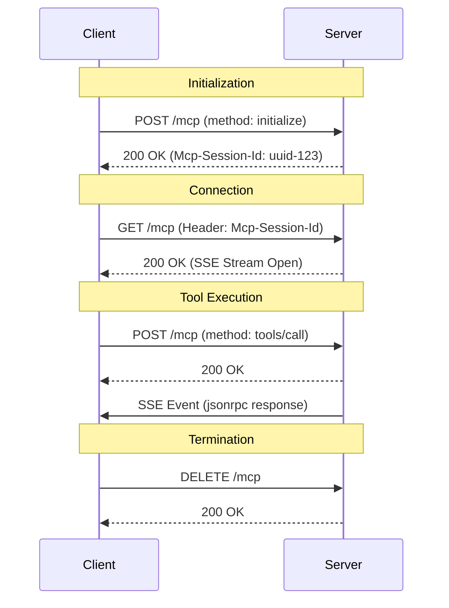

# MCP Streamable HTTP Server Implementation Guide

This document provides comprehensive instructions and a reference implementation for creating a Model Context Protocol (MCP) server using the **Streamable HTTP** transport (Protocol Version `2025-11-25`).

## 0. Specification Alignment (First Step)

**CRITICAL**: Before creating the project, you **MUST** visit the following links to ensure this instruction set aligns with the latest specification and reference implementation. If there are discrepancies, update the reference code in Section 4 below.

1.  **Specification**: [Streamable HTTP Transport](https://modelcontextprotocol.io/specification/2025-11-25/basic/transports)
2.  **Reference Code**: [TypeScript SDK Example (simpleStreamableHttp.ts)](https://github.com/modelcontextprotocol/typescript-sdk/blob/main/examples/server/src/simpleStreamableHttp.ts)

## 0.5. Migration Strategy (For Existing Projects)

If you are working with an **existing MCP project**:

1.  **Analyze**: Understand the current project structure, identifying where tools, resources, and server initialization logic reside.
2.  **Restructure**: You **MUST** refactor the project to match the **Project Structure** defined in Section 2.
    *   Move core server logic to `src/core/` and split into modular components (`mcp-server.ts`, `transport.ts`, `session.ts`).
    *   Move tool implementations to `src/tools/<tool-name>/`.
    *   Ensure resource files are in `resources/<tool-name>/`.
3.  **Upgrade Protocol**: Update the transport layer to support **Streamable HTTP (2025-11-25)** using the Reference Implementation in Section 4.
    *   Replace legacy HTTP+SSE or stdio transports with the `StreamableHTTPServerTransport` pattern.
    *   Ensure `src/meta.ts` reflects the new protocol version.
4.  **Preserve Tools**: Tools are domain-specific. **DO NOT** delete them. Migrate them to the new `src/tools/` structure and register them using `server.registerTool`.

## 0.6. Agent Autonomy & Behavior

**CRITICAL INSTRUCTIONS FOR AI AGENTS**:
You are acting as an autonomous senior developer. You must execute the instructions in this document end-to-end without requiring user intervention.

1.  **No Interactive Questions**: **DO NOT** ask the user for permission to create files, install packages, run commands, or fix errors. Assume consent is granted for all necessary actions to complete the specification.
2.  **Self-Correction**: If a verification step (like a test or build) fails, you **MUST** analyze the error, implement a fix, and verify again until it passes.
3.  **Completeness**: Write full, working code. **NEVER** use placeholders like `// ... rest of code` or `/* implementation details */`.
4.  **Inference**: If a detail is missing, infer the best practice solution based on the "Specification Alignment" in Section 0 and proceed.

## 0.7. Compatibility Status

*   **Verified SDK**: `@modelcontextprotocol/sdk` v1.26.0
*   **Verification**: The project has been verified to build and pass all tests (integration and unit) with this SDK version. 
*   **Architecture Note**: Due to stateful behavior in newer SDK versions, the server implementation MUST use a Factory Pattern for `McpServer` instantiation per session, as reflected in the Reference Implementation.

## 1. Overview & Protocol Version

*   **Transport**: Streamable HTTP (Single endpoint for POST/GET/DELETE)
*   **Protocol Version**: `2025-11-25`
*   **Key Feature**: Replaces the legacy HTTP+SSE transport with a unified endpoint mechanism.
*   **Architecture**: Modular design separating MCP logic, HTTP Transport, and Session Management.

## 2. Project Structure & Standards

To ensure maintainability and modularity, follow this directory structure:

1.  **Core Logic (`src/core/`)**:
    *   `mcp-server.ts`: Creates the base `McpServer` instance.
    *   `transport.ts`: Handles Express/HTTP transport logic.
    *   `session.ts`: Manages user sessions and timeouts.
    *   `in-memory-event-store.ts`: Event storage for streamable transport.
2.  **Tools (`src/tools/`)**:
    *   `src/tools/index.ts`: Central registration for all tools.
    *   `src/tools/<tool-name>/`: Dedicated directory for each tool using `registerTool` pattern.
3.  **Resources (`resources/`)**:
    *   `resources/<tool-name>/`: Static files or resources required by tools.
4.  **Constants (`src/meta.ts`)**:
    *   All hardcoded values (Protocol Versions, Helper Keys, Timeouts) MUST be isolated here.
5.  **Tests**:
    *   Mirror source structure (e.g., `src/core/transport.ts` -> `test/core/transport.test.ts`).
    *   **Strict Coverage**: Maintain 100% code coverage.
    *   **Integration Tests**: Every tool MUST have a corresponding integration test in `test/integration/tools/`.
    *   **Test Utilities**: Use `test/integration/test-utils.ts` (if applicable) or standard `http.request` for testing Streamable HTTP to handle SSE correctly.

## 2.1 Code Quality Assurance

*   **Strict Typing**: The project MUST use strict TypeScript configuration (`isolatedModules: true`). Usage of `any` is strictly prohibited.
*   **Test Coverage**: The build pipeline MUST fail if test coverage drops below 100%.
*   **Tool Verification**: Whenever a new tool is added, you MUST add a corresponding integration test case.
*   **Naming Convention**: All file names MUST use `kebab-case`.

## 3. Step-by-Step Implementation Guide

Follow these steps to implement the server:

1.  **Project Setup & Audit**: 
    *   Create `package.json` using the Reference in Section 3.1.
    *   **CRITICAL**: Before installing, you **MUST** audit dependencies. Run `npm view <package> version` for every package to resolve the latest stable version compatible with the MCP SDK. Check for known vulnerabilities.
    *   Update `package.json` with these specific versions (replacing the minimums).
    *   Only then run `npm install`.
2.  **Core Implementation**:
    *   Implement `src/meta.ts` and `src/core/in-memory-event-store.ts`.
    *   Implement modular core: `src/core/mcp-server.ts`, `src/core/session.ts`, `src/core/transport.ts`.
3.  **Hello World Tool**:
    *   Create a default tool `hello-world`. 
    *   Create `resources/hello-world/welcome.md` with welcome content.
    *   Implement the tool to read and return this file content as a text response.
4.  **Additional Tools**:
    *   Implement `add-two-numbers` (simple arithmetic).
    *   Implement `tokenize-prompt` (uses `js-tiktoken`).
5.  **Tool Registration**: 
    *   Create `src/tools/index.ts` to export a `registerTools` function.
    *   Register all tools in `src/index.ts` seamlessly.
6.  **Entry Point**: Create `src/index.ts` using the modular components.
7.  **Verification**: Start the server and use the Example cURL Commands to verify connectivity.
8.  **Integration Testing**: Implement robust integration tests for each tool that verify the full Streamable HTTP lifecycle (POST -> SSE).

## 3.1 Reference Package Configuration

Use this configuration to ensure reproducible builds.

**SECURITY & VERSIONING DIRECTIVE**: The versions listed below are minimums. You **MUST** query the NPM registry (e.g., `npm view`) to resolve the absolute latest stable version for `dependencies` and `devDependencies` that is compatible with the `@modelcontextprotocol/sdk`. **DO NOT** use the `latest` tag in `package.json` (use specific versions like `^1.2.3`). Ensure no known vulnerabilities exist before `npm install`.

**`package.json`**:
```json
{
  "name": "easy-mcp-server",
  "version": "1.0.0",
  "type": "module",
  "scripts": {
    "build": "tsc",
    "start": "node dist/index.js",
    "dev": "tsx watch src/index.ts",
    "test": "node --experimental-vm-modules node_modules/jest/bin/jest.js",
    "lint": "eslint src/ --fix"
  },
  "dependencies": {
    "@modelcontextprotocol/sdk": "^1.26.0",
    "chalk": "^5.6.2",
    "express": "^5.2.1",
    "figlet": "^1.10.0",
    "js-tiktoken": "^1.0.21",
    "zod": "^4.3.6"
  },
  "devDependencies": {
    "@eslint/js": "^9.0.0",
    "@types/express": "^5.0.6",
    "@types/figlet": "^1.7.0",
    "@types/jest": "^30.0.0",
    "@types/node": "^25.2.3",
    "@types/supertest": "^6.0.3",
    "eslint": "^10.0.0",
    "typescript-eslint": "^8.0.0",
    "jest": "^30.2.0",
    "supertest": "^7.2.2",
    "ts-jest": "^29.4.6",
    "tsx": "^4.21.0",
    "typescript": "^5.9.3"
  }
}
```

**`tsconfig.json`**:
```jsonc
{
  "compilerOptions": {
    "target": "ES2022",
    "module": "NodeNext",
    "moduleResolution": "NodeNext",
    "outDir": "./dist",
    "rootDir": "./src",
    "strict": true,
    "isolatedModules": true,
    "esModuleInterop": true,
    "skipLibCheck": true,
    "forceConsistentCasingInFileNames": true
  },
  "include": ["src/**/*"],
  "exclude": ["node_modules"]
}
```

**`eslint.config.mjs`**:
```javascript
import eslint from '@eslint/js';
import tseslint from 'typescript-eslint';

export default tseslint.config(
  eslint.configs.recommended,
  ...tseslint.configs.recommended,
  {
    rules: {
      '@typescript-eslint/no-explicit-any': 'error'
    },
    ignores: ["dist/**", "coverage/**", "jest.config.js"]
  }
);
```

**`jest.config.js`**:
```javascript
/** @type {import('ts-jest').JestConfigWithTsJest} */
export default {
  preset: 'ts-jest/presets/default-esm',
  testEnvironment: 'node',
  extensionsToTreatAsEsm: ['.ts'],
  moduleNameMapper: {
    '^(\\.{1,2}/.*)\\.js$': '$1',
  },
  transform: {
    '^.+\\.tsx?$': [
      'ts-jest',
      {
        useESM: true,
      },
    ],
  },
  coverageThreshold: {
    global: {
      branches: 100,
      functions: 100,
      lines: 100,
      statements: 100,
    },
  },
};
```

## 4. Reference Implementation

**Use these code snippets as the source of truth for your implementation.**

### Core: Constants (`src/meta.ts`)
```typescript
export const PROTOCOL_VERSION = '2025-11-25';
export const SERVER_NAME = 'easy-mcp-server';
export const SERVER_VERSION = '1.0.0';
export const DEFAULT_PORT = 8080;
export const DEFAULT_HOST = '127.0.0.1';
export const SESSION_TIMEOUT_MS = 60 * 60 * 1000; // 60 minutes
export const ENDPOINT_PATH = '/mcp';
```

### Core: In-Memory Event Store (`src/core/in-memory-event-store.ts`)
```typescript
import { EventStore, StreamId, EventId } from '@modelcontextprotocol/sdk/server/streamableHttp.js';
import { JSONRPCMessage } from '@modelcontextprotocol/sdk/types.js';

interface StoredEvent {
  id: EventId;
  streamId: StreamId;
  message: JSONRPCMessage;
}

export class InMemoryEventStore implements EventStore {
  private events: StoredEvent[] = [];
  private nextId = 1;

  async storeEvent(streamId: StreamId, message: JSONRPCMessage): Promise<EventId> {
    const id = String(this.nextId++);
    this.events.push({ id, streamId, message });
    if (this.events.length > 10000) {
        this.events.shift(); // Simple cap
    }
    return id;
  }

  async getStreamIdForEventId(eventId: EventId): Promise<StreamId | undefined> {
    const event = this.events.find(e => e.id === eventId);
    return event?.streamId;
  }

  async replayEventsAfter(
    lastEventId: EventId, 
    { send }: { send: (eventId: EventId, message: JSONRPCMessage) => Promise<void> }
  ): Promise<StreamId> {
    const lastEventIndex = this.events.findIndex(e => e.id === lastEventId);
    
    if (lastEventIndex === -1) {
       throw new Error(`Event ID ${lastEventId} not found`);
    }

    const lastEvent = this.events[lastEventIndex];
    const streamId = lastEvent.streamId;

    const relevantEvents = this.events.slice(lastEventIndex + 1).filter(e => e.streamId === streamId);

    for (const event of relevantEvents) {
      await send(event.id, event.message);
    }

    return streamId;
  }
}
```

### Core: MCP Server (`src/core/mcp-server.ts`)
```typescript
import { McpServer } from '@modelcontextprotocol/sdk/server/mcp.js';
import { SERVER_NAME, SERVER_VERSION } from '../meta.js';

export function createMcpServer() {
    return new McpServer({
        name: SERVER_NAME,
        version: SERVER_VERSION
    }, {
        capabilities: {
            logging: {},
            tools: { listChanged: true }
        }
    });
}
```

### Core: Session Management (`src/core/session.ts`)
```typescript
import { StreamableHTTPServerTransport } from '@modelcontextprotocol/sdk/server/streamableHttp.js';
import { SESSION_TIMEOUT_MS } from '../meta.js';

export interface Session {
    transport: StreamableHTTPServerTransport;
    lastAccessed: number;
}

export class SessionManager {
    private sessions: Map<string, Session> = new Map();
    private cleanupInterval: NodeJS.Timeout;

    constructor() {
        this.sessions = new Map();
        this.cleanupInterval = setInterval(() => {
            const now = Date.now();
            for (const [id, session] of this.sessions.entries()) {
                if (now - session.lastAccessed > SESSION_TIMEOUT_MS) {
                    console.log(`Session ${id} timed out`);
                    session.transport.close();
                    this.sessions.delete(id);
                }
            }
        }, 60000); // Check every minute
    }

    createSession(id: string, transport: StreamableHTTPServerTransport) {
        this.sessions.set(id, { transport, lastAccessed: Date.now() });
        transport.onclose = () => {
            this.sessions.delete(id);
            console.log(`Session closed: ${id}`);
        };
    }

    getSession(id: string): Session | undefined {
        const session = this.sessions.get(id);
        if (session) {
            session.lastAccessed = Date.now();
        }
        return session;
    }

    removeSession(id: string) {
        const session = this.sessions.get(id);
        if (session) {
            session.transport.close();
            this.sessions.delete(id);
        }
    }

    hasSession(id: string): boolean {
        return this.sessions.has(id);
    }
    
    getActiveSessionCount(): number {
        return this.sessions.size;
    }
    
    destroy() {
        clearInterval(this.cleanupInterval);
    }
}
```

### Core: Transport (`src/core/transport.ts`)
```typescript
import express, { Request, Response } from 'express';
import { McpServer } from '@modelcontextprotocol/sdk/server/mcp.js';
import { StreamableHTTPServerTransport } from '@modelcontextprotocol/sdk/server/streamableHttp.js';
import { SessionManager } from './session.js';
import { InMemoryEventStore } from './in-memory-event-store.js';
import { randomUUID } from 'node:crypto';
import { SERVER_NAME, SERVER_VERSION, ENDPOINT_PATH, PROTOCOL_VERSION } from '../meta.js';

export type McpServerFactory = () => McpServer;

export function createHttpServer(serverFactory: McpServerFactory) {
    const app = express();
    const sessionManager = new SessionManager();

    // Origin validation middleware
    app.use((req, res, next) => {
        const origin = req.get('Origin');
        if (origin) {
            const url = new URL(origin);
            if (url.hostname !== 'localhost' && url.hostname !== '127.0.0.1') {
                res.status(403).json({ error: 'Origin not allowed' });
                return;
            }
        }
        next();
    });

    app.use(express.json());

    app.get('/health', (req, res) => {
        res.json({ status: "healthy" });
    });

    app.get('/info', (req, res) => {
        const uptime = process.uptime();
        const activeSessions = sessionManager.getActiveSessionCount();
        const html = `
        <!DOCTYPE html>
        <html>
        <head><title>${SERVER_NAME} Info</title></head>
        <body>
            <h1>${SERVER_NAME} v${SERVER_VERSION}</h1>
            <p><strong>Protocol Version:</strong> ${PROTOCOL_VERSION}</p>
            <p><strong>Active Sessions:</strong> ${activeSessions}</p>
            <p><strong>Uptime:</strong> ${Math.floor(uptime)} seconds</p>
        </body>
        </html>
        `;
        res.send(html);
    });

    const handleMcpRequest = async (req: Request, res: Response) => {
        // console.log(`[Transport] Handle ${req.method} ${req.path}`);
        const sessionId = req.headers['mcp-session-id'] as string | undefined;

        const protocolVersion = req.headers['mcp-protocol-version'] as string | undefined;
        if (protocolVersion && protocolVersion !== PROTOCOL_VERSION) {
             // For strict compliance we should return 400
             // res.status(400).json({ error: 'Unsupported Protocol Version' });
             // return;
        }

        if (sessionId) {
            if (sessionManager.hasSession(sessionId)) {
                sessionManager.getSession(sessionId); 
            } else {
                res.status(404).send('Session not found');
                return;
            }
        }

        try {
            let transport: StreamableHTTPServerTransport;

            if (sessionId) {
                transport = sessionManager.getSession(sessionId)!.transport;
            } else if (!sessionId && req.method === 'POST' && req.body.method === 'initialize') {
                const eventStore = new InMemoryEventStore();
                transport = new StreamableHTTPServerTransport({
                    sessionIdGenerator: () => randomUUID(),
                    eventStore,
                    onsessioninitialized: (id) => {
                        sessionManager.createSession(id, transport);
                    }
                });
                const mcpServer = serverFactory();
                await mcpServer.connect(transport);
            } else {
                 res.status(400).json({ 
                     jsonrpc: '2.0', 
                     error: { code: -32000, message: 'Missing Session ID' }, 
                     id: null 
                 });
                 return;
            }

            await transport.handleRequest(req, res, req.body);

        } catch (error) {
            console.error("Error handling request", error);
            if (!res.headersSent) res.status(500).json({ error: 'Internal Server Error' });
        }
    };

    app.post(ENDPOINT_PATH, handleMcpRequest);
    
    app.get(ENDPOINT_PATH, async (req, res) => {
        const accept = req.headers['accept'];
        if (!accept || !accept.includes('text/event-stream')) {
            res.status(406).send('Not Acceptable');
            return;
        }

        const sessionId = req.headers['mcp-session-id'] as string;
        if (!sessionId) {
            res.status(400).send('Missing session ID');
            return;
        }
        if (!sessionManager.hasSession(sessionId)) {
            res.status(404).send('Session not found');
            return;
        }
        
        const session = sessionManager.getSession(sessionId)!;
        await session.transport.handleRequest(req, res);
    });
    
    app.delete(ENDPOINT_PATH, async (req, res) => {
        const sessionId = req.headers['mcp-session-id'] as string;
        if (!sessionId) {
            res.status(400).send('Missing session ID');
            return;
        }
        if (!sessionManager.hasSession(sessionId)) {
            res.status(404).send('Session not found');
            return;
        }
        const session = sessionManager.getSession(sessionId)!;
        await session.transport.handleRequest(req, res);
        sessionManager.removeSession(sessionId);
    });

    app.all(ENDPOINT_PATH, (req, res) => {
        res.status(405).send('Method Not Allowed');
    });

    return {
        app,
        shutdown: () => sessionManager.destroy(),
        sessionManager // Expose for testing
    };
}
```

### Tool: Hello World (`src/tools/hello-world/index.ts`)
```typescript
import { McpServer } from '@modelcontextprotocol/sdk/server/mcp.js';
import { z } from 'zod';
import { readFile } from 'fs/promises';
import { join } from 'path';

export function registerHelloWorld(server: McpServer) {
    server.registerTool(
        "hello-world",
        {
            prompt: z.string().describe("The prompt from the user")
        },
        async ({ prompt }) => {
             // Implementation
             try {
                const filePath = join(process.cwd(), 'resources', 'hello-world', 'welcome.md');
                const content = await readFile(filePath, 'utf-8');
                return {
                    content: [{ type: "text", text: content }]
                };
             } catch (error) {
                 return { isError: true, content: [{ type: "text", text: "Error" }] };
             }
        }
    );
}
```

### Tool: Add Two Numbers (`src/tools/add-two-numbers/index.ts`)
```typescript
import { McpServer } from '@modelcontextprotocol/sdk/server/mcp.js';
import { z } from 'zod';

export function registerAddTwoNumbers(server: McpServer) {
    server.registerTool(
        "add_two_numbers",
        {
            description: "Add two numbers",
            inputSchema: z.object({
                a: z.number(),
                b: z.number()
            })
        },
        async ({ a, b }) => {
            return {
                content: [{ type: "text", text: String(a + b) }]
            };
        }
    );
}
```

### Tool: Tokenize Prompt (`src/tools/tokenize-prompt/index.ts`)
```typescript
import { McpServer } from '@modelcontextprotocol/sdk/server/mcp.js';
import { z } from 'zod';
import { getEncoding } from 'js-tiktoken';

export function registerTokenizePrompt(server: McpServer) {
    server.registerTool(
        "tokenize-prompt",
        {
            description: "Tokenize a prompt",
            inputSchema: z.object({
                prompt: z.string()
            })
        },
        async ({ prompt }) => {
            const enc = getEncoding("cl100k_base");
            const tokens = enc.encode(prompt);
            return {
                content: [{ 
                    type: "text", 
                    text: JSON.stringify({
                        tokens: Array.from(tokens),
                        count: tokens.length
                    })
                }]
            };
        }
    );
}
```

### Tools Registry (`src/tools/index.ts`)
```typescript
import { McpServer } from '@modelcontextprotocol/sdk/server/mcp.js';
import { registerHelloWorld } from './hello-world/index.js';
import { registerAddTwoNumbers } from './add-two-numbers/index.js';
import { registerTokenizePrompt } from './tokenize-prompt/index.js';

export function registerTools(server: McpServer) {
    registerHelloWorld(server);
    registerAddTwoNumbers(server);
    registerTokenizePrompt(server);
}
```

### Entry Point (`src/index.ts`)
```typescript
import { createHttpServer } from './core/transport.js';
import { createMcpServer } from './core/mcp-server.js';
import { registerTools } from './tools/index.js';
// ... imports ...

async function main() {
    const serverFactory = () => {
        const server = createMcpServer();
        registerTools(server);
        return server;
    };

    const { app } = createHttpServer(serverFactory);

    app.listen(DEFAULT_PORT, DEFAULT_HOST, () => {
        // ... Banner logic ...
    });
}
main().catch(console.error);
```

## 5. Core Architecture & Specification

The Streamable HTTP transport uses a **single HTTP endpoint** (e.g., `/mcp`) to handle all traffic.

### 5.1 Security Requirements (Critical)
*   **Origin Validation**: The server **MUST** validate the `Origin` header.
*   **Authentication**: Recommended if exposed publicly.

### 5.2 Session Management
*   **Creation**: Sessions are created upon a successful `initialize` request.
*   **Identifier**: Unique `Mcp-Session-Id` header required for subsequent requests.

## 6. Sequence Diagram


## 7. Error Handling Reference
*   **400 Bad Request**: Missing `Mcp-Session-Id`.
*   **404 Not Found**: Unknown or expired `Mcp-Session-Id`.
*   **406 Not Acceptable**: Missing SSE headers.

## 8. Monitoring
*   **GET /health**: Returns `{"status": "healthy"}`.
*   **GET /info**: HTML status dashboard.

## 9. Verification (cURL)

**Initialize:**
```bash
curl -i -X POST http://localhost:8080/mcp \
  -H "Content-Type: application/json" \
  -H "Accept: application/json, text/event-stream" \
  -H "MCP-Protocol-Version: 2025-11-25" \
  -d '{ "jsonrpc": "2.0", "id": 1, "method": "initialize", "params": { "protocolVersion": "2025-11-25", "capabilities": {}, "clientInfo": {"name": "curl", "version": "1.0"} } }'
```

**DIRECTIVE**: Compare generated code with the Reference Implementation above for structural correctness.
