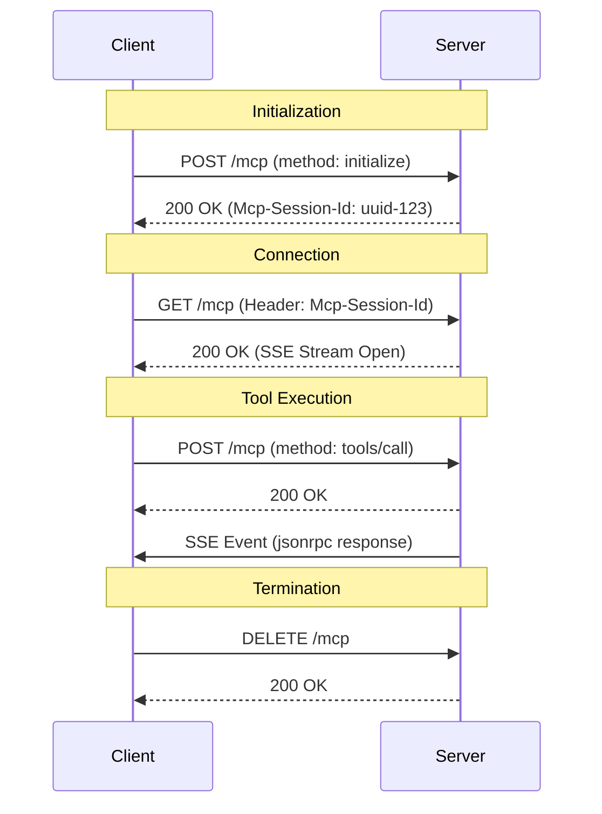

# MCP Streamable HTTP Server Implementation Guide

This document provides comprehensive instructions and a reference implementation for creating a Model Context Protocol (MCP) server using the **Streamable HTTP** transport (Protocol Version `2025-11-25`).

## 0. Specification Alignment (First Step)

**CRITICAL**: Before creating the project, you **MUST** visit the following links to ensure this instruction set aligns with the latest specification and reference implementation. If there are discrepancies, update the reference code in Section 4 below.

1.  **Specification**: [Streamable HTTP Transport](https://modelcontextprotocol.io/specification/2025-11-25/basic/transports)
2.  **Reference Code**: [TypeScript SDK Example (simpleStreamableHttp.ts)](https://github.com/modelcontextprotocol/typescript-sdk/blob/main/examples/server/src/simpleStreamableHttp.ts)

## 0.5. Migration Strategy (For Existing Projects)

If you are working with an **existing MCP project**:

1.  **Analyze**: Understand the current project structure, identifying where tools, resources, and server initialization logic reside.
2.  **Restructure**: You **MUST** refactor the project to match the **Project Structure** defined in Section 2.
    *   Move core server logic to `src/core/` and split into modular components (`mcp-server.ts`, `transport.ts`, `session.ts`).
    *   Move tool implementations to `src/tools/<tool-name>/`.
    *   Ensure resource files are in `resources/<tool-name>/`.
3.  **Upgrade Protocol**: Update the transport layer to support **Streamable HTTP (2025-11-25)** using the Reference Implementation in Section 4.
    *   Replace legacy HTTP+SSE or stdio transports with the `StreamableHTTPServerTransport` pattern.
    *   Ensure `src/meta.ts` reflects the new protocol version.
4.  **Preserve Tools**: Tools are domain-specific. **DO NOT** delete them. Migrate them to the new `src/tools/` structure and register them using `server.registerTool`.

## 0.6. Agent Autonomy & Behavior

**CRITICAL INSTRUCTIONS FOR AI AGENTS**:
You are acting as an autonomous senior developer. You must execute the instructions in this document end-to-end without requiring user intervention.

1.  **No Interactive Questions**: **DO NOT** ask the user for permission to create files, install packages, run commands, or fix errors. Assume consent is granted for all necessary actions to complete the specification.
2.  **Self-Correction**: If a verification step (like a test or build) fails, you **MUST** analyze the error, implement a fix, and verify again until it passes.
3.  **Completeness**: Write full, working code. **NEVER** use placeholders like `// ... rest of code` or `/* implementation details */`.
4.  **Inference**: If a detail is missing, infer the best practice solution based on the "Specification Alignment" in Section 0 and proceed.

## 1. Overview & Protocol Version

*   **Transport**: Streamable HTTP (Single endpoint for POST/GET/DELETE)
*   **Protocol Version**: `2025-11-25`
*   **Key Feature**: Replaces the legacy HTTP+SSE transport with a unified endpoint mechanism.
*   **Architecture**: Modular design separating MCP logic, HTTP Transport, and Session Management.

## 2. Project Structure & Standards

To ensure maintainability and modularity, follow this directory structure:

1.  **Core Logic (`src/core/`)**:
    *   `mcp-server.ts`: Creates the base `McpServer` instance.
    *   `transport.ts`: Handles Express/HTTP transport logic.
    *   `session.ts`: Manages user sessions and timeouts.
    *   `in-memory-event-store.ts`: Event storage for streamable transport.
2.  **Tools (`src/tools/`)**:
    *   `src/tools/index.ts`: Central registration for all tools.
    *   `src/tools/<tool-name>/`: Dedicated directory for each tool using `registerTool` pattern.
3.  **Resources (`resources/`)**:
    *   `resources/<tool-name>/`: Static files or resources required by tools.
4.  **Constants (`src/meta.ts`)**:
    *   All hardcoded values (Protocol Versions, Helper Keys, Timeouts) MUST be isolated here.
5.  **Tests**:
    *   Mirror source structure (e.g., `src/core/transport.ts` -> `test/core/transport.test.ts`).
    *   **Strict Coverage**: Maintain 100% code coverage.
    *   **Integration Tests**: Every tool MUST have a corresponding integration test in `test/integration/tools/`.
    *   **Test Utilities**: Use `test/integration/test-utils.ts` (if applicable) or standard `http.request` for testing Streamable HTTP to handle SSE correctly.

## 2.1 Code Quality Assurance

*   **Strict Typing**: The project MUST use strict TypeScript configuration (`isolatedModules: true`). Usage of `any` is strictly prohibited.
*   **Test Coverage**: The build pipeline MUST fail if test coverage drops below 100%.
*   **Tool Verification**: Whenever a new tool is added, you MUST add a corresponding integration test case.
*   **Naming Convention**: All file names MUST use `kebab-case`.

## 3. Step-by-Step Implementation Guide

Follow these steps to implement the server:

1.  **Project Setup**: Initialize the project using the Reference `package.json` in Section 3.1.
2.  **Core Implementation**:
    *   Implement `src/meta.ts` and `src/core/in-memory-event-store.ts`.
    *   Implement modular core: `src/core/mcp-server.ts`, `src/core/session.ts`, `src/core/transport.ts`.
3.  **Hello World Tool**:
    *   Create a default tool `hello-world`. 
    *   Create `resources/hello-world/welcome.md` with welcome content.
    *   Implement the tool to read and return this file content as a text response.
4.  **Tool Registration**: 
    *   Create `src/tools/index.ts` to export a `registerTools` function.
    *   Register all tools in `src/index.ts` seamlessly.
5.  **Entry Point**: Create `src/index.ts` using the modular components.
6.  **Verification**: Start the server and use the Example cURL Commands to verify connectivity.
7.  **Integration Testing**: Implement robust integration tests for each tool that verify the full Streamable HTTP lifecycle (POST -> SSE).

## 3.1 Reference Package Configuration

Use this configuration to ensure reproducible builds.

**`package.json`**:
```json
{
  "name": "easy-mcp-server",
  "version": "1.0.0",
  "type": "module",
  "scripts": {
    "build": "tsc",
    "start": "node dist/index.js",
    "dev": "tsx watch src/index.ts",
    "test": "node --experimental-vm-modules node_modules/jest/bin/jest.js",
    "lint": "eslint src/ --fix"
  },
  "dependencies": {
    "@modelcontextprotocol/sdk": "^1.0.1",
    "chalk": "^5.3.0",
    "express": "^4.21.1",
    "figlet": "^1.8.0",
    "zod": "^3.23.8"
  },
  "devDependencies": {
    "@types/express": "^5.0.0",
    "@types/figlet": "^1.5.8",
    "@types/jest": "^29.5.14",
    "@types/node": "^22.9.0",
    "eslint": "^9.15.0",
    "jest": "^29.7.0",
    "ts-jest": "^29.2.5",
    "tsx": "^4.19.2",
    "typescript": "^5.6.3"
  }
}
```

## 4. Reference Implementation

**Use these code snippets as the source of truth for your implementation.**

### Core: MCP Server (`src/core/mcp-server.ts`)
```typescript
import { McpServer } from '@modelcontextprotocol/sdk/server/mcp.js';
import { SERVER_NAME, SERVER_VERSION } from '../meta.js';

export function createMcpServer() {
    return new McpServer({
        name: SERVER_NAME,
        version: SERVER_VERSION
    }, {
        capabilities: {
            logging: {},
            tools: { listChanged: true }
        }
    });
}
```

### Core: Session Management (`src/core/session.ts`)
```typescript
import { StreamableHTTPServerTransport } from '@modelcontextprotocol/sdk/server/streamableHttp.js';
import { SESSION_TIMEOUT_MS } from '../meta.js';

export interface Session {
    transport: StreamableHTTPServerTransport;
    lastAccessed: number;
}

export class SessionManager {
    private sessions: Map<string, Session> = new Map();
    private cleanupInterval: NodeJS.Timeout;

    constructor() {
        this.sessions = new Map();
        this.cleanupInterval = setInterval(() => {
            const now = Date.now();
            for (const [id, session] of this.sessions.entries()) {
                if (now - session.lastAccessed > SESSION_TIMEOUT_MS) {
                    session.transport.close();
                    this.sessions.delete(id);
                }
            }
        }, 60000);
    }
    // ... implement createSession, getSession, removeSession, hasSession ...
    destroy() { clearInterval(this.cleanupInterval); }
}
```

### Core: Transport (`src/core/transport.ts`)
```typescript
import express, { Request, Response } from 'express';
import { McpServer } from '@modelcontextprotocol/sdk/server/mcp.js';
// ... imports ...

export function createHttpServer(mcpServer: McpServer) {
    const app = express();
    const sessionManager = new SessionManager();
    // ... middleware, health checks ...

    // Important: Use explicit JSON middleware or handle it in transport if needed
    app.use(express.json());

    const handleMcpRequest = async (req: Request, res: Response) => {
        // ... Session handling ID logic ...
        // ... Transport creation using StreamableHTTPServerTransport ...
        // ... mcpServer.connect(transport) ...
    };

    app.post('/mcp', handleMcpRequest);
    app.get('/mcp', /* SSE logic using session.transport.handleRequest */);
    app.delete('/mcp', /* cleanup logic */);

    return { 
        app, 
        shutdown: () => sessionManager.destroy(),
        sessionManager // Expose for testing
    };
}
```

### Tool: Hello World (`src/tools/hello-world/index.ts`)
```typescript
import { McpServer } from '@modelcontextprotocol/sdk/server/mcp.js';
import { z } from 'zod';
import { readFile } from 'fs/promises';
import { join } from 'path';

export function registerHelloWorld(server: McpServer) {
    server.registerTool(
        "hello-world",
        {
            prompt: z.string().describe("The prompt from the user")
        },
        async ({ prompt }) => {
             // Implementation
             try {
                const filePath = join(process.cwd(), 'resources', 'hello-world', 'welcome.md');
                const content = await readFile(filePath, 'utf-8');
                return {
                    content: [{ type: "text", text: content }]
                };
             } catch (error) {
                 return { isError: true, content: [{ type: "text", text: "Error" }] };
             }
        }
    );
}
```

### Entry Point (`src/index.ts`)
```typescript
import { createHttpServer } from './core/transport.js';
import { createMcpServer } from './core/mcp-server.js';
import { registerTools } from './tools/index.js';
// ... imports ...

async function main() {
    const mcpServer = createMcpServer();
    const { app } = createHttpServer(mcpServer);

    registerTools(mcpServer);

    app.listen(DEFAULT_PORT, DEFAULT_HOST, () => {
        // ... Banner logic ...
    });
}
main().catch(console.error);
```

## 5. Core Architecture & Specification

The Streamable HTTP transport uses a **single HTTP endpoint** (e.g., `/mcp`) to handle all traffic.

### 5.1 Security Requirements (Critical)
*   **Origin Validation**: The server **MUST** validate the `Origin` header.
*   **Authentication**: Recommended if exposed publicly.

### 5.2 Session Management
*   **Creation**: Sessions are created upon a successful `initialize` request.
*   **Identifier**: Unique `Mcp-Session-Id` header required for subsequent requests.

## 6. Sequence Diagram


## 7. Error Handling Reference
*   **400 Bad Request**: Missing `Mcp-Session-Id`.
*   **404 Not Found**: Unknown or expired `Mcp-Session-Id`.
*   **406 Not Acceptable**: Missing SSE headers.

## 8. Monitoring
*   **GET /health**: Returns `{"status": "healthy"}`.
*   **GET /info**: HTML status dashboard.

## 9. Verification (cURL)

**Initialize:**
```bash
curl -i -X POST http://localhost:8080/mcp \
  -H "Content-Type: application/json" \
  -H "Accept: application/json, text/event-stream" \
  -H "MCP-Protocol-Version: 2025-11-25" \
  -d '{ "jsonrpc": "2.0", "id": 1, "method": "initialize", "params": { "protocolVersion": "2025-11-25", "capabilities": {}, "clientInfo": {"name": "curl", "version": "1.0"} } }'
```

**DIRECTIVE**: Compare generated code with the Reference Implementation above for structural correctness.
