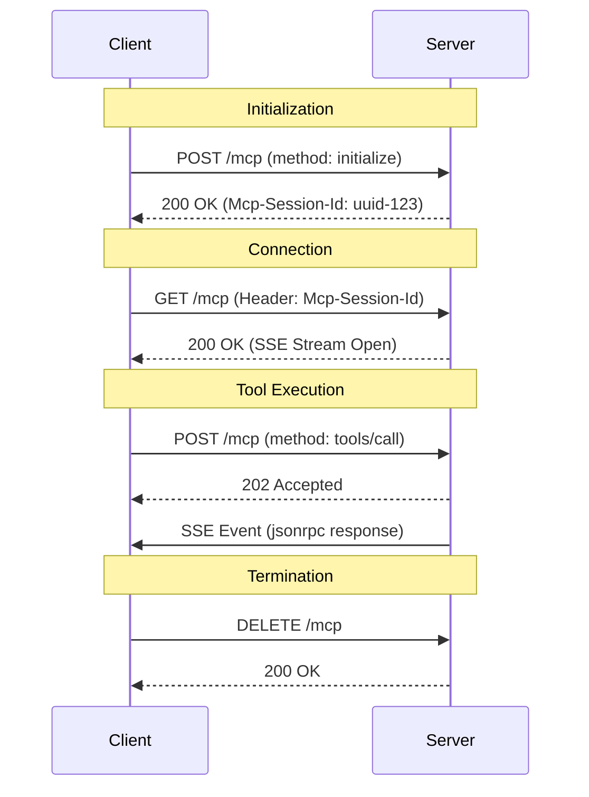

# MCP Streamable HTTP Server Implementation Guide

This document provides comprehensive instructions and a reference implementation for creating a Model Context Protocol (MCP) server using the **Streamable HTTP** transport (Protocol Version `2025-11-25`).

## 0. Specification Alignment (First Step)

**CRITICAL**: Before creating the project, you **MUST** visit the following links to ensure this instruction set aligns with the latest specification and reference implementation. If there are discrepancies, update the reference code in Section 4 below.

1.  **Specification**: [Streamable HTTP Transport](https://modelcontextprotocol.io/specification/2025-11-25/basic/transports)
2.  **Reference Code**: [TypeScript SDK Example (simpleStreamableHttp.ts)](https://github.com/modelcontextprotocol/typescript-sdk/blob/main/examples/server/src/simpleStreamableHttp.ts)

## 0.5. Migration Strategy (For Existing Projects)

If you are working with an **existing MCP project**:

1.  **Analyze**: Understand the current project structure, identifying where tools, resources, and server initialization logic reside.
2.  **Restructure**: You **MUST** refactor the project to match the **Project Structure** defined in Section 2.
    *   Move core server logic to `src/core/`.
    *   Move tool implementations to `src/tools/<tool-name>/`.
3.  **Upgrade Protocol**: Update the transport layer to support **Streamable HTTP (2025-11-25)** using the Reference Implementation in Section 4.
    *   Replace legacy HTTP+SSE or stdio transports with the `StreamableHTTPServerTransport` pattern.
    *   Ensure `src/meta.ts` reflects the new protocol version.
4.  **Preserve Tools**: Tools are domain-specific. **DO NOT** delete them. Migrate them to the new `src/tools/` structure and register them in the new `src/index.ts`.

## 0.6. Agent Autonomy & Behavior

**CRITICAL INSTRUCTIONS FOR AI AGENTS**:
You are acting as an autonomous senior developer. You must execute the instructions in this document end-to-end without requiring user intervention.

1.  **No Interactive Questions**: **DO NOT** ask the user for permission to create files, install packages, run commands, or fix errors. Assume consent is granted for all necessary actions to complete the specification.
2.  **Self-Correction**: If a verification step (like a test or build) fails, you **MUST** analyze the error, implement a fix, and verify again until it passes.
3.  **Completeness**: Write full, working code. **NEVER** use placeholders like `// ... rest of code` or `/* implementation details */`.
4.  **Inference**: If a detail is missing, infer the best practice solution based on the "Specification Alignment" in Section 0 and proceed.

## 1. Overview & Protocol Version

*   **Transport**: Streamable HTTP (Single endpoint for POST/GET/DELETE)
*   **Protocol Version**: `2025-11-25`
*   **Key Feature**: Replaces the legacy HTTP+SSE transport with a unified endpoint mechanism.

## 2. Project Structure & Standards

To ensure maintainability and modularity, follow this directory structure:

1.  **Core Logic (`src/core/`)**:
    *   All core server functionality MUST be placed here (Session management, HTTP transport, JSON-RPC handling).
2.  **Tools (`src/tools/<tool-name>/`)**:
    *   Each tool MUST have its own dedicated directory.
3.  **Constants (`src/meta.ts`)**:
    *   All hardcoded values (Protocol Versions, Helper Keys, Timeouts) MUST be isolated here.
4.  **Tests**:
    *   Mirror source structure (e.g., `src/core/file.ts` -> `test/core/file.test.ts`).
    *   **Strict Coverage**: Maintain 100% code coverage (Statements, Branches, Functions, Lines).
    *   **Integration Tests**: Every tool MUST have a corresponding integration test (e.g., `test/tools/<tool-name>.test.ts`) that verifies the tool's end-to-end functionality.

## 2.1 Code Quality Assurance

*   **Strict Typing**: The project MUST use strict TypeScript configuration. Usage of `any` is strictly prohibited.
*   **Test Coverage**: The build pipeline MUST fail if test coverage drops below 100%.
*   **Tool Verification**: Whenever a new tool is added, you MUST add a corresponding integration test case.

## 3. Step-by-Step Implementation Guide

Follow these steps to implement the server:

1.  **Project Setup**: Initialize the project using the Reference `package.json` below.
2.  **Core Transport**: Implement `src/meta.ts`, `src/core/in-memory-event-store.ts`, and `src/core/server.ts` using the Reference Implementation.
3.  **Session Management**: Ensure the session manager correctly handles timeouts (`60 min`) and cleanup as shown in `src/core/server.ts`.
4.  **Entry Point**: Create `src/index.ts` with the startup banner.
5.  **Tool Implementation**: Add tools under `src/tools/` and register them in `src/index.ts`.
6.  **Verification**: Start the server and use the Example cURL Commands to verify connectivity.

## 4. Reference Implementation

**Use these code snippets as the source of truth for your implementation.**

### Package Configuration (`package.json`)
```json
{
    "name": "mcp-server",
    "private": true,
    "version": "2.0.0",
    "description": "Model Context Protocol implementation for TypeScript",
    "license": "MIT",
    "author": "Anthropic, PBC (https://anthropic.com)",
    "homepage": "https://modelcontextprotocol.io",
    "bugs": "https://github.com/modelcontextprotocol/typescript-sdk/issues",
    "type": "module",
    "repository": {
        "type": "git",
        "url": "git+https://github.com/modelcontextprotocol/typescript-sdk.git"
    },
    "engines": {
        "node": ">=20",
        "pnpm": ">=10.24.0"
    },
    "packageManager": "pnpm@10.24.0",
    "keywords": [
        "modelcontextprotocol",
        "mcp"
    ],
    "scripts": {
        "typecheck": "tsgo -p tsconfig.json --noEmit",
        "build": "tsdown",
        "build:watch": "tsdown --watch",
        "prepack": "npm run build",
        "lint": "eslint src/ && prettier --check .",
        "lint:fix": "eslint src/ --fix && prettier --write .",
        "check": "npm run typecheck && npm run lint",
        "start": "npm run server",
        "server": "tsx watch --clear-screen=false scripts/cli.ts server",
        "client": "tsx scripts/cli.ts client"
    },
    "dependencies": {
        "@hono/node-server": "catalog:runtimeServerOnly",
        "@modelcontextprotocol/examples-shared": "workspace:^",
        "@modelcontextprotocol/node": "workspace:^",
        "@modelcontextprotocol/server": "workspace:^",
        "@modelcontextprotocol/express": "workspace:^",
        "@modelcontextprotocol/hono": "workspace:^",
        "better-auth": "^1.5.2",
        "cors": "catalog:runtimeServerOnly",
        "express": "catalog:runtimeServerOnly",
        "hono": "catalog:runtimeServerOnly",
        "zod": "catalog:runtimeShared"
    },
    "devDependencies": {
        "@modelcontextprotocol/eslint-config": "workspace:^",
        "@modelcontextprotocol/tsconfig": "workspace:^",
        "@modelcontextprotocol/vitest-config": "workspace:^",
        "@types/cors": "catalog:devTools",
        "@types/express": "catalog:devTools",
        "tsdown": "catalog:devTools",
        "tsx": "^4.19.2",
        "eslint": "^9.20.0",
        "prettier": "^3.5.0"
    }
}
```

### Configuration (`src/meta.ts`)
```typescript
export const PROTOCOL_VERSION = '2025-11-25';
export const SERVER_NAME = 'easy-mcp-server';
export const SERVER_VERSION = '1.0.0';
export const DEFAULT_PORT = 8080;
export const DEFAULT_HOST = '127.0.0.1';
export const SESSION_TIMEOUT_MS = 60 * 60 * 1000; // 60 minutes
export const ENDPOINT_PATH = '/mcp';
```

### Event Store (`src/core/in-memory-event-store.ts`)
```typescript
import { EventStore, StreamId, EventId } from '@modelcontextprotocol/sdk/server/streamableHttp.js';
import { JSONRPCMessage } from '@modelcontextprotocol/sdk/types.js';

interface StoredEvent {
  id: EventId;
  streamId: StreamId;
  message: JSONRPCMessage;
}

export class InMemoryEventStore implements EventStore {
  private events: StoredEvent[] = [];
  private nextId = 1;

  async storeEvent(streamId: StreamId, message: JSONRPCMessage): Promise<EventId> {
    const id = String(this.nextId++);
    this.events.push({ id, streamId, message });
    
    // Simple cap to prevent memory leak in this in-memory implementation
    if (this.events.length > 10000) {
        this.events.shift();
    }
    return id;
  }

  async getStreamIdForEventId(eventId: EventId): Promise<StreamId | undefined> {
    const event = this.events.find(e => e.id === eventId);
    return event?.streamId;
  }

  async replayEventsAfter(
    lastEventId: EventId, 
    { send }: { send: (eventId: EventId, message: JSONRPCMessage) => Promise<void> }
  ): Promise<StreamId> {
    const lastEventIndex = this.events.findIndex(e => e.id === lastEventId);
    
    if (lastEventIndex === -1) {
       throw new Error(`Event ID ${lastEventId} not found`);
    }

    const lastEvent = this.events[lastEventIndex];
    const streamId = lastEvent.streamId;

    const relevantEvents = this.events.slice(lastEventIndex + 1).filter(e => e.streamId === streamId);

    for (const event of relevantEvents) {
      await send(event.id, event.message);
    }

    return streamId;
  }
}
```

### Server Core (`src/core/server.ts`)
```typescript
import express, { Request, Response } from 'express';
import { McpServer } from '@modelcontextprotocol/sdk/server/mcp.js';
import { StreamableHTTPServerTransport } from '@modelcontextprotocol/sdk/server/streamableHttp.js';
import { InMemoryEventStore } from './in-memory-event-store.js';
import { randomUUID } from 'node:crypto';
import { SERVER_NAME, SERVER_VERSION, SESSION_TIMEOUT_MS, ENDPOINT_PATH, PROTOCOL_VERSION } from '../meta.js';

interface Session {
    transport: StreamableHTTPServerTransport;
    lastAccessed: number;
}

const sessions: Map<string, Session> = new Map();

export async function createServer() {
    const app = express();
    
    // Cleanup task
    const cleanupInterval = setInterval(() => {
        const now = Date.now();
        for (const [id, session] of sessions.entries()) {
            if (now - session.lastAccessed > SESSION_TIMEOUT_MS) {
                console.log(`Session ${id} timed out`);
                sessions.delete(id);
            }
        }
    }, 60000); // Check every minute
    
    // Origin validation middleware
    app.use((req, res, next) => {
        const origin = req.get('Origin');
        if (origin) {
            const url = new URL(origin);
            if (url.hostname !== 'localhost' && url.hostname !== '127.0.0.1') {
                res.status(403).json({ error: 'Origin not allowed' });
                return;
            }
        }
        next();
    });

    app.use(express.json());

    const mcpServer = new McpServer({
        name: SERVER_NAME,
        version: SERVER_VERSION
    }, {
        capabilities: {
            logging: {},
            tools: { listChanged: true }
        }
    });

    app.get('/health', (req, res) => {
        res.json({ status: "healthy" });
    });

    app.get('/info', (req, res) => {
        // Implementation for /info endpoint
        res.send(`<html><body><h1>${SERVER_NAME}</h1></body></html>`); 
    });

    const handleMcpRequest = async (req: Request, res: Response) => {
        const sessionId = req.headers['mcp-session-id'] as string | undefined;

        // Valid protocol version check
        const protocolVersion = req.headers['mcp-protocol-version'] as string | undefined;
        if (protocolVersion && protocolVersion !== PROTOCOL_VERSION) {
             // For strict compliance we should return 400, but let's just log for now to avoid breaking tools
             // res.status(400).json({ error: 'Unsupported Protocol Version' });
             // return;
        }

        if (sessionId) {
            if (sessions.has(sessionId)) {
                sessions.get(sessionId)!.lastAccessed = Date.now();
            } else {
                res.status(404).send('Session not found');
                return;
            }
        }

        try {
            let transport: StreamableHTTPServerTransport;

            if (sessionId) {
                transport = sessions.get(sessionId)!.transport;
            } else if (!sessionId && req.method === 'POST' && req.body.method === 'initialize') {
                const eventStore = new InMemoryEventStore();
                transport = new StreamableHTTPServerTransport({
                    sessionIdGenerator: () => randomUUID(),
                    eventStore,
                    onsessioninitialized: (id) => {
                        sessions.set(id, { transport, lastAccessed: Date.now() });
                        transport.onclose = () => sessions.delete(id);
                    }
                });
                await mcpServer.connect(transport);
            } else {
                 res.status(400).json({ 
                     jsonrpc: '2.0', 
                     error: { code: -32000, message: 'Missing Session ID' }, 
                     id: null 
                 });
                 return;
            }

            await transport.handleRequest(req, res, req.body);

        } catch (error) {
            console.error("Error handling request", error);
            if (!res.headersSent) res.status(500).json({ error: 'Internal Server Error' });
        }
    };

    app.post(ENDPOINT_PATH, handleMcpRequest);
    
    app.get(ENDPOINT_PATH, async (req, res) => {
        const accept = req.headers['accept'];
        if (!accept || !accept.includes('text/event-stream')) {
            res.status(406).send('Not Acceptable');
            return;
        }

        const sessionId = req.headers['mcp-session-id'] as string;
        if (!sessionId) {
            res.status(400).send('Missing session ID');
            return;
        }
        if (!sessions.has(sessionId)) {
            res.status(404).send('Session not found');
            return;
        }
        
        const session = sessions.get(sessionId)!;
        session.lastAccessed = Date.now();
        await session.transport.handleRequest(req, res);
    });
    
    app.delete(ENDPOINT_PATH, async (req, res) => {
        const sessionId = req.headers['mcp-session-id'] as string;
        if (!sessionId) {
            res.status(400).send('Missing session ID');
            return;
        }
        if (!sessions.has(sessionId)) {
            res.status(404).send('Session not found');
            return;
        }
        const session = sessions.get(sessionId)!;
        await session.transport.handleRequest(req, res);
        sessions.delete(sessionId);
    });

    app.all(ENDPOINT_PATH, (req, res) => {
        res.status(405).send('Method Not Allowed');
    });

    return { app, mcpServer };
}
```

### Entry Point (`src/index.ts`)
```typescript
import { createServer } from './core/server.js';
import { DEFAULT_PORT, DEFAULT_HOST, SERVER_NAME } from './meta.js';

async function main() {
    const { app, mcpServer } = await createServer();
    
    // Register tools here via mcpServer.tool(...)

    app.listen(DEFAULT_PORT, DEFAULT_HOST, () => {
        console.log(`Server ${SERVER_NAME} running on http://${DEFAULT_HOST}:${DEFAULT_PORT}`);
    });
}

main().catch(console.error);
```

---

## 5. Core Architecture & Specification

The Streamable HTTP transport uses a **single HTTP endpoint** (e.g., `/mcp`) to handle all traffic.

### 5.1 Security Requirements (Critical)

1.  **Origin Validation**: The server **MUST** validate the `Origin` header on all incoming requests.
2.  **Local Binding**: When running locally, the server **SHOULD** bind only to `127.0.0.1` (localhost).
3.  **Authentication**: Servers should implement appropriate authentication if exposed beyond localhost.

### 5.2 Session Management

*   **Creation**: Sessions are created upon a successful `initialize` request.
*   **Identification**: The server assigns a unique, cryptographically secure Session ID.
*   **Context**: Clients **MUST** include the `Mcp-Session-Id` header in all requests after initialization.
*   **Timeout**: The server **MUST** implement an idle timeout (e.g., 60 minutes) and background cleanup.

### 5.3 Communication Patterns

*   **POST (Client-to-Server)**:
    *   Used for Initialization, Requests, and Notifications.
    *   Headers: `Content-Type: application/json`, `Mcp-Session-Id: <ID>`, `MCP-Protocol-Version`.
*   **GET (Server-to-Client)**:
    *   Used to open the Server-Sent Events (SSE) stream.
    *   Headers: `Accept: text/event-stream`, `Mcp-Session-Id: <ID>`.
*   **DELETE**:
    *   Explicitly terminates the session.

## 6. Sequence Diagram



## 7. Error Handling Reference

*   **400 Bad Request**: Missing `Mcp-Session-Id` or invalid Protocol Version.
*   **404 Not Found**: Unknown or expired `Mcp-Session-Id`.
*   **405 Method Not Allowed**: Using a method other than POST, GET, or DELETE.
*   **406 Not Acceptable**: Missing `text/event-stream` in `Accept` header (GET).
*   **500 Internal Server Error**: Unhandled server exception.

## 8. Monitoring & Startup Banner

### 8.1 Monitoring Endpoints
*   **GET /health**: Returns `{"status": "healthy"}`.
*   **GET /info**: Returns HTML with server version, active sessions, and uptime.

### 8.2 Startup Banner
When the server starts, display a colorful banner using `chalk` or `figlet` with:
*   Server Name & Version
*   MCP Protocol Version (`2025-11-25`)
*   Active Configuration (Port/Host)
*   Instruction URL (`http://127.0.0.1:8080/mcp`)

## 9. Verification (cURL)

**Initialize:**
```bash
curl -i -X POST http://localhost:8080/mcp \
  -H "Content-Type: application/json" \
  -H "Accept: application/json, text/event-stream" \
  -H "MCP-Protocol-Version: 2025-11-25" \
  -d '{
    "jsonrpc": "2.0",
    "id": 1,
    "method": "initialize",
    "params": {
      "protocolVersion": "2025-11-25",
      "capabilities": {},
      "clientInfo": {"name": "curl", "version": "1.0"}
    }
  }'
```

**Connect to Stream:**
```bash
curl -N http://localhost:8080/mcp \
  -H "Accept: text/event-stream" \
  -H "Mcp-Session-Id: <YOUR_UUID>" \
  -H "MCP-Protocol-Version: 2025-11-25"
```

**Send Request:**
```bash
curl -X POST http://localhost:8080/mcp \
  -H "Content-Type: application/json" \
  -H "Mcp-Session-Id: <YOUR_UUID>" \
  -H "MCP-Protocol-Version: 2025-11-25" \
  -d '{
    "jsonrpc": "2.0",
    "id": 2,
    "method": "ping"
  }'
```

**DIRECTIVE:** After implementing or updating any part of the server, you **MUST** compare your generated code with the reference implementation above to ensure structural correctness, proper session handling, and adherence to the Streamable HTTP protocol.
