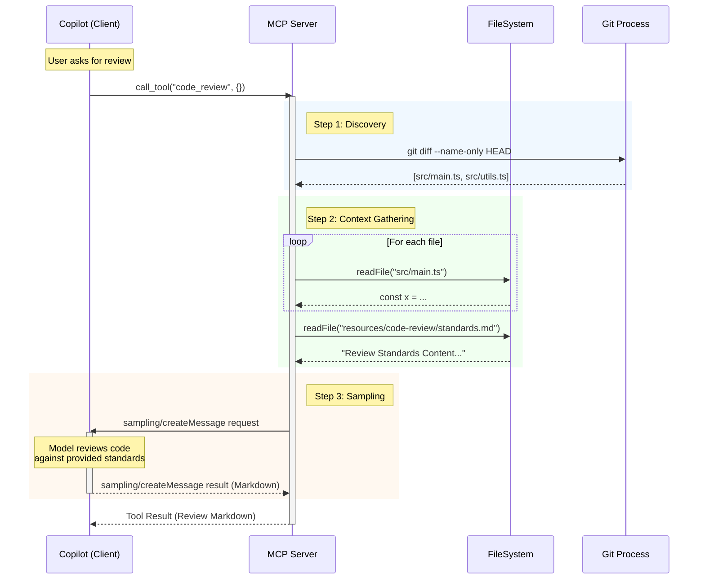

# Code Review Tool Design (MCP Server)

## 1. Overview
The `code_review` tool leverages the **MCP SDK (`@modelcontextprotocol/sdk`)** to invoke the **Copilot Model internally** via the Sampling API (`createMessage`). This allows the server to act as an autonomous agent that gathers strictly defined context (git changes) and programmatically requests a review from the underlying model, ensuring validation standards are applied without user intervention.

## 2. Detailed Data Flow

1.  **Invocation**: User invokes `code_review` (manually or via chat).
2.  **Discovery (Server-Side)**:
    *   The Server runs `git diff --name-only` to strictly identify modified files.
3.  **Context Gathering (Server-Side)**:
    *   The Server reads `resources/code-review/standards.md` (Validation Standards).
    *   The Server reads the exact file content from disk.
4.  **Model Invocation (Internal SDK Call)**:
    *   The Server constructs a structured prompt (Context + Standards).
    *   **CRITICAL**: The Server calls `server.createMessage()` (from `mcp-sdk`).
    *   This internally prompts the host (GitHub Copilot) to generate the review using its high-quality model.
5.  **Result Delivery**:
    *   The Model returns the generated markdown review.
    *   The Server sends this back as the tool result.

## 3. Sequence Diagram



## 4. File Structure Impact

We will modify the project structure as follows:

```text
resources/
    code-review/
        standards.md       <-- NEW: Validation standards & guidelines
src/
    tools/
        code-review/       <-- NEW: Tool implementation
            index.ts
        index.ts           <-- MODIFIED: Register new tool
test/
    tools/
        code-review/       <-- NEW: Unit tests
            index.test.ts
```

## 5. Component Design

### 5.1 Tool Definition (`src/tools/code-review/index.ts`)

**Schema:**
```typescript
const inputSchema = z.object({
  files: z.array(z.string())
    .optional()
    .describe('List of file paths to review. If omitted, reviews all modified git files.')
});
```

**Sampling Logic (Pseudo-code):**
```typescript
const systemPrompt = `
You are a senior code reviewer. 
Review the provided code based on the following standards:
${standardsContent}

Focus on:
1. Security vulnerabilities
2. Performance optimizations
3. TypeScript best practices
4. Maintainability
`;

const result = await server.createMessage({
  messages: [{
    role: 'user',
    content: { 
      type: 'text', 
      text: `Review these modified files:\n\n` + files.map(f => `## ${f.name}\n\`\`\`\n${f.content}\n\`\`\``).join('\n') 
    }
  }],
  systemPrompt: systemPrompt
});
```

### 5.2 Resources (`resources/code-review/standards.md`)
This file will contain the "Instructions" mentioned in the requirements. It serves as the customizable configuration for the review bot.

**Example Content:**
```markdown
# Validation Standards
- Ensure all public functions have JSDoc comments.
- No `console.log` in production code; use the Logger.
- Use `zod` for all I/O validation.
- Ensure rigorous type safety (no `any`).
```

## 6. Security & Performance Considerations

1.  **Payload Size**: If `git diff` returns too many files or very large files, the context window might be exceeded.
    *   *Mitigation*: We will implement a limit (e.g., max 5 files or 50kb text) and warn if exceeded.
2.  **Sensitive Data**: The tool reads local files.
    *   *Mitigation*: The "Context Gathering" step happens entirely on the user's machine (in the MCP server process). Data is only sent to the Client via the `sampling/createMessage` protocol which is an authorized channel.
3.  **Command Execution**: `exec('git diff')` runs generic shell commands.
    *   *Mitigation*: We will use `child_process.execFile` or explicit argument separation to prevent shell injection, though arguments here are internally generated.
