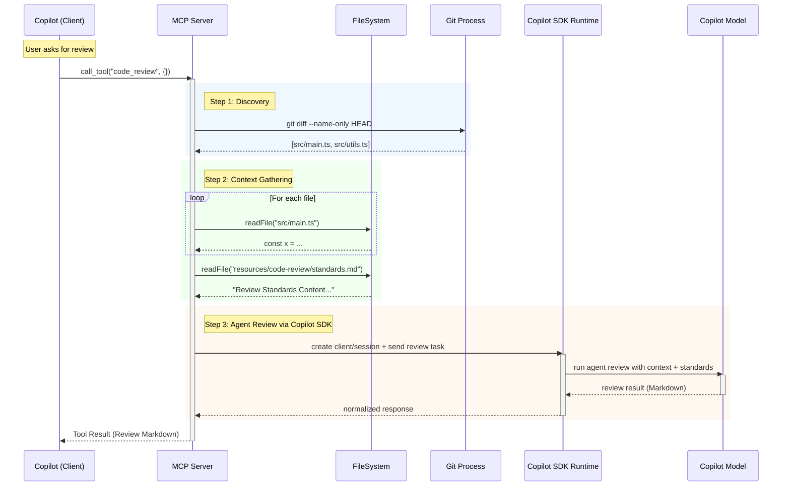

# Code Review Tool Design (MCP Server)

## Implementation Status
**Current State**: Using MCP Sampling (`server.createMessage`)  
**Target State**: Migrate to Copilot SDK agent runtime  
**Status**: Design complete, implementation in progress

## 1. Overview
The `code_review` tool uses the **Copilot SDK (technical preview)** from within the MCP server to run a review as an **autonomous agent workflow**. Instead of relying on MCP Sampling (`server.createMessage`), the tool gathers deterministic local context (git changes + standards), starts a Copilot SDK conversation/session, and requests a structured review from the Copilot runtime.

This separates responsibilities clearly:
- **MCP server**: tool interface, local context collection, guardrails, deterministic limits.
- **Copilot SDK agent runtime**: model orchestration, multi-turn reasoning, optional tool execution loop.

### References
- **Copilot SDK**: [@github/copilot-sdk v0.1.23](https://www.npmjs.com/package/@github/copilot-sdk) (Published February 2026)
- **SDK Repository**: [github/copilot-sdk](https://github.com/github/copilot-sdk)
- **Node.js child_process**: [Official Documentation](https://nodejs.org/api/child_process.html)

## 2. Dependencies

### Required Packages
```json
{
  "dependencies": {
    "@github/copilot-sdk": "^0.1.23"
  }
}
```

### Installation & Setup
```bash
# Install Copilot SDK
npm install @github/copilot-sdk@^0.1.23

# Verify Copilot CLI is installed (requirement for SDK)
copilot --version

# If not installed, follow: https://docs.github.com/en/copilot/how-tos/set-up/install-copilot-cli
```

### Authentication
The SDK supports multiple authentication methods (see [Auth Documentation](https://github.com/github/copilot-sdk/blob/main/docs/auth/index.md)):
- **GitHub signed-in user**: Uses stored OAuth credentials from `copilot` CLI login
- **Environment variables**: `COPILOT_GITHUB_TOKEN`, `GH_TOKEN`, `GITHUB_TOKEN`
- **BYOK (Bring Your Own Key)**: Use your own API keys from Anthropic/OpenAI (no GitHub auth required)

For this tool, we recommend using the GitHub signed-in user method (default) or environment variables.

### System Requirements
- **Node.js**: >= 20.0.0
- **Copilot CLI**: Must be installed and accessible in PATH
- **GitHub Copilot Subscription**: Required (unless using BYOK)

## 3. Detailed Data Flow

1.  **Invocation**: User invokes `code_review` (manually or via chat).
2.  **Discovery (Server-Side)**:
    *   The Server runs `git diff --name-only` to strictly identify modified files.
3.  **Context Gathering (Server-Side)**:
    *   The Server reads `resources/code-review/standards.md` (Validation Standards).
    *   The Server reads the exact file content from disk.
4.  **Agent Session Bootstrap (Copilot SDK)**:
    *   The Server initializes a Copilot SDK client/session (Node.js package: `@github/copilot-sdk`).
    *   The Server selects a **Claude** model for review generation (configurable default).
    *   The Server creates an agent task with strict system instructions + gathered context.
5.  **Agent Review Execution**:
    *   The agent performs the review (single-turn or multi-turn internally).
    *   The server enforces output expectations (Markdown/text contract, size limits, deterministic fallback).
6.  **Result Delivery**:
    *   The Copilot SDK returns the generated markdown review.
    *   The Server sends this back as the tool result.

## 4. Sequence Diagram



## 5. File Structure (Implemented)

Current project structure for the tool is:

```text
resources/
    code-review/
        standards.md
src/
    tools/
        code-review/
            index.ts
        index.ts
test/
    tools/
        code-review/
            index.test.ts
```

Registration already exists in `src/tools/index.ts` and includes `code_review` in `REGISTERED_TOOL_NAMES`.

## 6. Configuration

### Environment Variables
```bash
# Authentication (choose one)
export COPILOT_GITHUB_TOKEN="ghp_xxx..."  # Preferred
# or
export GH_TOKEN="ghp_xxx..."
# or
export GITHUB_TOKEN="ghp_xxx..."

# Model Selection (optional, defaults to claude-sonnet-4.5)
export CODE_REVIEW_MODEL="claude-sonnet-4.5"

# Resource Limits (optional)
export CODE_REVIEW_MAX_FILES=5          # Max files per review
export CODE_REVIEW_MAX_FILE_SIZE=50000  # Max bytes per file
export CODE_REVIEW_TIMEOUT=60000        # Timeout in ms (60s)
```

### Available Models
Based on [Copilot SDK documentation](https://github.com/github/copilot-sdk), supported models include:
- **`gpt-5`**: OpenAI GPT-5 (default for general use)
- **`claude-sonnet-4.5`**: Anthropic Claude Sonnet 4.5 ([claude-sonnet-4-5-20250929](https://platform.claude.com/docs/en/docs/models-overview)) - Recommended for code review
- **`claude-opus-4.6`**: Anthropic Claude Opus 4.6 - Most intelligent for complex tasks
- **`claude-haiku-4.5`**: Anthropic Claude Haiku 4.5 - Fastest with near-frontier intelligence

For code review, we default to `claude-sonnet-4.5` for its optimal balance of speed and code understanding.

## 7. Component Design

### 7.1 Tool Definition (`src/tools/code-review/index.ts`)

**Schema:**
```typescript
const inputSchema = z.object({
  files: z.array(z.string())
    .optional()
    .describe('List of file paths (relative to workspace root) to review. If omitted, auto-discovers modified files using git.')
});
```

**Agent Logic via Copilot SDK (Implementation-Ready Code):**
```typescript
// Based on @github/copilot-sdk v0.1.23 API
// Reference: https://www.npmjs.com/package/@github/copilot-sdk
import { CopilotClient } from '@github/copilot-sdk';

const taskInstructions = `
You are a senior code reviewer.
Apply these standards exactly:
${standardsContent}

Return concise, actionable findings grouped by severity.
Include suggested patch snippets when useful.
`;

const reviewPayload = `Review these files:\n\n` +
    files.map((f) => `## ${f.name}\n\`\`\`typescript\n${f.content}\n\`\`\``).join('\n\n');

const reviewModel = process.env.CODE_REVIEW_MODEL ?? 'claude-sonnet-4.5';
const reviewTimeout = parseInt(process.env.CODE_REVIEW_TIMEOUT ?? '60000', 10);

const client = new CopilotClient();

try {
    await client.start();
    
    const session = await client.createSession({
        model: reviewModel,
        systemMessage: {
            content: taskInstructions
        }
    });
    
    try {
        const reviewResponse = await session.sendAndWait(
            { prompt: reviewPayload },
            reviewTimeout
        );
        
        const reviewText = reviewResponse?.data?.content ?? 'Review completed (no text output).';
        
        return {
            content: [{ type: 'text', text: reviewText }]
        };
    } finally {
        await session.destroy();
    }
} finally {
    await client.stop();
}
```

### 7.2 Resources (`resources/code-review/standards.md`)
This file will contain the "Instructions" mentioned in the requirements. It serves as the customizable configuration for the review bot.

**Example Content:**
```markdown
# Validation Standards
- Ensure all public functions have JSDoc comments.
- No `console.log` in production code; use the Logger.
- Use `zod` for all I/O validation.
- Ensure rigorous type safety (no `any`).
```

## 8. Security & Performance Considerations

### 8.1 Payload Size Limits
**Issue**: Large file sets or files can exceed context windows.  
**Resource Limits**:
- `CODE_REVIEW_MAX_FILES=5` (max files per review)
- `CODE_REVIEW_MAX_FILE_SIZE=50000` (50 KB per file)
- **Total context limit**: ~250 KB (5 files × 50 KB)

**Implementation**:
```typescript
const MAX_FILES = parseInt(process.env.CODE_REVIEW_MAX_FILES ?? '5', 10);
const MAX_FILE_SIZE = parseInt(process.env.CODE_REVIEW_MAX_FILE_SIZE ?? '50000', 10);

if (targetFiles.length > MAX_FILES) {
    return {
        isError: true,
        content: [{ 
            type: 'text', 
            text: `Too many files (${targetFiles.length}). Maximum: ${MAX_FILES}. Specify fewer files or split into multiple reviews.` 
        }]
    };
}

// Per-file size check during read
const stats = await stat(absPath);
if (stats.size > MAX_FILE_SIZE) {
    errors.push(`File too large: ${filePath} (${stats.size} bytes, max: ${MAX_FILE_SIZE})`);
    continue;
}
```

### 8.2 Sensitive Data
**Issue**: Tool reads local files.  
**Mitigation**: Context gathering happens entirely locally. Only selected content is sent via authenticated Copilot SDK channel. Files are read using workspace-relative paths to prevent directory traversal.

### 8.3 Command Injection Prevention
**Issue**: Current implementation uses `exec('git diff')` which spawns a shell.  
**Reference**: [Node.js child_process.execFile()](https://nodejs.org/api/child_process.html#child_processexecfilefile-args-options-callback)

**FIXED Implementation**:
```typescript
import { execFile } from 'node:child_process';
import { promisify } from 'node:util';

const execFileAsync = promisify(execFile);

async function getGitModifiedFiles(): Promise<string[]> {
    try {
        // Use execFile instead of exec - does not spawn shell
        // Reference: https://nodejs.org/api/child_process.html#child_processexecfilefile-args-options-callback
        const { stdout } = await execFileAsync('git', ['diff', '--name-only', 'HEAD'], {
            cwd: PROJECT_ROOT,
            maxBuffer: 1024 * 1024 // 1 MB
        });
        return stdout.split('\n').map(f => f.trim()).filter(f => f.length > 0);
    } catch (error) {
        return [];
    }
}
```

**Why execFile?** (per [Node.js docs](https://nodejs.org/api/child_process.html)):
- Does **not** spawn a shell by default
- Arguments are passed as array, preventing injection
- More efficient than `exec` on Unix systems
- Shell metacharacters cannot trigger arbitrary command execution

### 8.4 Path Validation
**Issue**: User-provided file paths could escape workspace.  
**Mitigation**:
```typescript
import { normalize, isAbsolute, relative } from 'node:path';

function validateFilePath(inputPath: string, workspaceRoot: string): string | null {
    // Reject absolute paths
    if (isAbsolute(inputPath)) return null;
    
    // Normalize to prevent "../" escapes
    const normalized = normalize(inputPath);
    const fullPath = join(workspaceRoot, normalized);
    const relativePath = relative(workspaceRoot, fullPath);
    
    // Ensure result is still within workspace
    if (relativePath.startsWith('..')) return null;
    
    return fullPath;
}
```

### 8.5 Timeout Handling
**Issue**: Review operations could hang indefinitely.  
**Mitigation**: All operations have timeouts:
- Git operations: 10s
- File reads: 5s each
- SDK session: Configurable via `CODE_REVIEW_TIMEOUT` (default: 60s)

## 9. Tool API Contract

### 9.1 Input
- `files?: string[]`
  - If provided and non-empty: review those files.
  - If omitted or empty: auto-discover with `git diff --name-only HEAD`.

### 9.2 Output
- Success: `CallToolResult` with `content` containing a single text entry (Markdown review body).
- No targets found: `CallToolResult` with non-error text message (`No modified files found to review.`).
- Read/Copilot-SDK failures: `CallToolResult` with `isError: true` and a text error message.

### 9.3 Failure Modes
- **Git unavailable / not a git repo**: auto-discovery returns no files; tool returns no-target message unless explicit files were provided.
- **File unreadable**: skipped and accumulated as an error detail; if all fail, return `isError: true`.
- **File too large**: skipped with error message (exceeds `CODE_REVIEW_MAX_FILE_SIZE`).
- **Too many files**: return `isError: true` before reading any files.
- **Standards file missing**: fallback standards text is used (see below).
- **Copilot SDK invocation failure**: return `isError: true` with invocation error details.
- **Network/API failures**: Captured and returned as `isError: true`.
- **Timeout exceeded**: Session terminated, partial results returned if available.
- **Authentication failure**: Clear error message directing user to run `copilot auth login`.

**Fallback Standards Text** (when `resources/code-review/standards.md` is missing):
```
# Code Review Standards (Fallback)

## General Principles
- Ensure code readability and maintainability
- Check for proper error handling
- Verify type safety and avoid `any`
- Look for security vulnerabilities
- Assess performance implications

## Specific Checks
- All public functions should have JSDoc comments
- Use Zod for input validation
- Prefer `execFile` over `exec` for child processes
- No hardcoded credentials or secrets
```

### 9.4 Determinism Rules
- **File ordering**: Alphabetical sort applied to both git-discovered and user-provided files for consistent results.
- **Error messages**: Use stable templates for non-success outcomes (tests can assert exact behavior).
- **Model determinism**: Note that LLM outputs are non-deterministic by nature; same input may yield different review content.

## 10. Testing Strategy

### 10.1 Unit Tests (`test/tools/code-review/index.test.ts`)
**Focus**: Tool logic isolation without SDK calls
```typescript
// Mock Copilot SDK for unit tests
jest.mock('@github/copilot-sdk');

describe('code-review tool', () => {
    test('validates file paths reject absolute paths', () => { /* ... */ });
    test('enforces max file limit', () => { /* ... */ });
    test('enforces max file size', () => { /* ... */ });
    test('falls back to default standards when file missing', () => { /* ... */ });
    test('uses execFile for git operations', () => { /* ... */ });
});
```

### 10.2 Integration Tests (`test/integration/tools/code-review.test.ts`)
**Focus**: End-to-end with real SDK/CLI (requires Copilot subscription)
```typescript
// Requires COPILOT_GITHUB_TOKEN or logged-in CLI
describe('code-review integration', () => {
    test('reviews actual code files', async () => {
        // Uses real Copilot SDK
        const result = await callCodeReviewTool({ files: ['src/index.ts'] });
        expect(result.content[0].text).toContain('review');
    }, 120000); // 2min timeout
    
    test('handles git repository detection', async () => { /* ... */ });
});
```

### 10.3 Test Fixtures
- `test/fixtures/code-review/sample-code.ts`: Sample code with intentional issues
- `test/fixtures/code-review/standards-custom.md`: Test standards file
- `test/fixtures/code-review/expected-output.md`: Sample review template for assertions

### 10.4 CI/CD Considerations
- Unit tests run on every commit (no SDK required)
- Integration tests run only when `COPILOT_GITHUB_TOKEN` is set
- Use GitHub Actions secrets for authentication in CI

## 11. Observability & Debugging

### 11.1 Logging Strategy
```typescript
import { Logger } from '../core/logger.js';

const logger = Logger.create('code-review');

// Log all review operations with context
logger.info('Starting code review', { 
    fileCount: targetFiles.length, 
    model: reviewModel 
});

logger.debug('Git diff output', { files: targetFiles });

logger.error('SDK invocation failed', { 
    error: err.message, 
    model: reviewModel,
    timeout: reviewTimeout 
});
```

### 11.2 Metrics to Track
- **Duration**: Time from invocation to completion
- **Token usage**: Input/output tokens (if SDK exposes metrics)
- **Success rate**: Successful reviews vs errors
- **File counts**: Average files per review
- **Model distribution**: Which models are used

### 11.3 Request Context Integration
Use existing `request-context.ts` to track review operations:
```typescript
import { withRequestContext } from '../core/request-context.js';

export function registerCodeReview(server: McpServer) {
    server.registerTool('code_review', schema, async (input) => {
        return withRequestContext('code_review', async (ctx) => {
            ctx.log('info', 'Code review started', { files: input.files });
            // ... implementation
        });
    });
}
```

### 11.4 Debug Mode
```bash
# Enable verbose SDK logging
export DEBUG="@github/copilot-sdk:*"

# Enable tool debug output
export LOG_LEVEL="debug"

npm run dev
```

## 12. Tool Registration & Aliases

### 12.1 Registration in `src/tools/index.ts`
```typescript
import { registerCodeReview } from './code-review/index.js';

export const REGISTERED_TOOL_NAMES = [
    'hello-world',
    'add_two_numbers',
    'add-two-numbers',    // UX alias
    'code_review',        // Primary name
    'code-review',        // UX alias for consistency
] as const;

export function registerTools(server: McpServer) {
    registerHelloWorld(server);
    registerAddTwoNumbers(server); // Also registers 'add-two-numbers' alias
    registerCodeReview(server);     // Should also register 'code-review' alias
}
```

### 12.2 Alias Implementation
```typescript
export function registerCodeReview(server: McpServer) {
    const schema = {
        description: 'Review code changes against project standards using Copilot agent.',
        inputSchema: z.object({ /* ... */ })
    };
    
    const handler = async (input: { files?: string[] }) => {
        // ... implementation
    };
    
    // Register primary name
    server.registerTool('code_review', schema, handler);
    
    // Register UX alias for consistency with kebab-case convention
    server.registerTool('code-review', schema, handler);
}
```

## 13. Output Format Specification

### 13.1 Expected Review Structure
The model should return Markdown with the following sections:

```markdown
# Code Review Summary

## Overall Assessment
[High-level summary of the code quality]

## Critical Issues (🔴)
### [File]: [Issue Title]
**Severity**: Critical
**Line**: [line number or range]
**Problem**: [description]
**Fix**:
​```typescript
[suggested code]
​```

## Warnings (🟡)
[Similar structure]

## Suggestions (🟢)
[Similar structure]

## Positive Observations
[What's done well]
```

### 13.2 Model Prompt Template
```typescript
const systemPrompt = `You are a senior software engineer performing a code review.

RETURN FORMAT:
Use the following Markdown template:

# Code Review Summary
## Overall Assessment
[summary]

## Issues
### 🔴 Critical Issues
[if any]

### 🟡 Warnings  
[if any]

### 🟢 Suggestions
[if any]

## Positive Observations
[always include]

For each issue, provide:
- File and line number
- Clear problem description
- Specific fix with code snippet

STANDARDS:
${standards}

Be concise but actionable. Prioritize security and correctness over style.`;
```

## 14. Performance Benchmarks

### 14.1 Expected Latency
- **Single file (<1000 lines)**: 5-10 seconds
- **5 files**: 15-30 seconds
- **With extended thinking**: +10-20 seconds

### 14.2 Token Usage Estimates
- **Input**: ~2000 tokens per file (average)
- **Output**: ~1000 tokens per review
- **Standards**: ~500 tokens

### 14.3 Concurrency Limits
- **Per-session limit**: 1 review at a time per MCP session
- **Global limit**: Determined by Copilot API rate limits
- **Recommendation**: Queue reviews server-side if needed

## 15. Migration Checklist

### Phase 1: Preparation
- [x] Design document created
- [ ] Install `@github/copilot-sdk@^0.1.23`
- [ ] Verify Copilot CLI installed and authenticated
- [ ] Create test fixtures

### Phase 2: Implementation
- [ ] Update `src/tools/code-review/index.ts`:
  - [ ] Replace `exec` with `execFile` for git operations
  - [ ] Replace `server.createMessage` with Copilot SDK
  - [ ] Add resource limits (max files, file size)
  - [ ] Add path validation
  - [ ] Add timeout handling
  - [ ] Implement fallback standards
  - [ ] Add `code-review` alias registration
- [ ] Add configuration:
  - [ ] Environment variables in `.env.example`
  - [ ] Document model options
- [ ] Update `resources/code-review/standards.md`:
  - [ ] Add execFile recommendation
  - [ ] Add path validation rule

### Phase 3: Testing
- [ ] Write unit tests (with SDK mocking)
- [ ] Write integration tests
- [ ] Test error scenarios:
  - [ ] No git repository
  - [ ] Files too large
  - [ ] Too many files
  - [ ] Invalid file paths
  - [ ] SDK timeout
  - [ ] Authentication failure
- [ ] Verify cleanup on errors (session.destroy, client.stop)

### Phase 4: Documentation
- [ ] Update README with:
  - [ ] Copilot SDK requirement
  - [ ] Authentication setup
  - [ ] Configuration options
  - [ ] Usage examples
- [ ] Add troubleshooting guide
- [ ] Document model selection

### Phase 5: Deployment
- [ ] Run full test suite
- [ ] Verify no regressions in other tools
- [ ] Update version in `package.json`
- [ ] Tag release
- [ ] Monitor initial usage for errors

## 16. Approach Change Summary (Sampling → Copilot SDK Agent)

- **Removed approach**: MCP Sampling via `server.createMessage`.
- **New approach**: MCP tool handler invokes Copilot SDK agent runtime directly.
- **Why**: Better lifecycle control, clearer session handling, and alignment with Copilot SDK technical preview capabilities (multi-turn + tool execution + programmatic lifecycle).
- **Migration note**: Keep MCP tool contract unchanged (`code_review` input/output) while replacing only the internal model invocation layer.
- **Package**: `@github/copilot-sdk` v0.1.23 (latest as of February 2026)
- **Status**: Technical Preview - suitable for development and testing, production use pending GA release.
