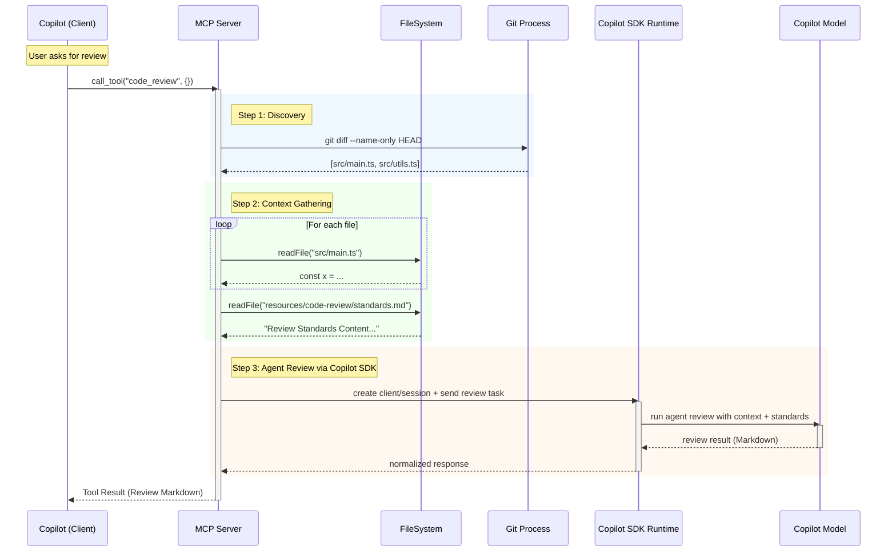

# Code Review Tool Design (MCP Server)

## 1. Overview
The `code_review` tool uses the **Copilot SDK (technical preview)** from within the MCP server to run a review as an **autonomous agent workflow**. Instead of relying on MCP Sampling (`server.createMessage`), the tool gathers deterministic local context (git changes + standards), starts a Copilot SDK conversation/session, and requests a structured review from the Copilot runtime.

This separates responsibilities clearly:
- **MCP server**: tool interface, local context collection, guardrails, deterministic limits.
- **Copilot SDK agent runtime**: model orchestration, multi-turn reasoning, optional tool execution loop.

## 2. Detailed Data Flow

1.  **Invocation**: User invokes `code_review` (manually or via chat).
2.  **Discovery (Server-Side)**:
    *   The Server runs `git diff --name-only` to strictly identify modified files.
3.  **Context Gathering (Server-Side)**:
    *   The Server reads `resources/code-review/standards.md` (Validation Standards).
    *   The Server reads the exact file content from disk.
4.  **Agent Session Bootstrap (Copilot SDK)**:
    *   The Server initializes a Copilot SDK client/session (Node.js SDK package in preview).
    *   The Server creates an agent task with strict system instructions + gathered context.
5.  **Agent Review Execution**:
    *   The agent performs the review (single-turn or multi-turn internally).
    *   The server enforces output expectations (Markdown/text contract, size limits, deterministic fallback).
6.  **Result Delivery**:
    *   The Copilot SDK returns the generated markdown review.
    *   The Server sends this back as the tool result.

## 3. Sequence Diagram



## 4. File Structure (Implemented)

Current project structure for the tool is:

```text
resources/
    code-review/
        standards.md
src/
    tools/
        code-review/
            index.ts
        index.ts
test/
    tools/
        code-review/
            index.test.ts
```

Registration already exists in `src/tools/index.ts` and includes `code_review` in `REGISTERED_TOOL_NAMES`.

## 5. Component Design

### 5.1 Tool Definition (`src/tools/code-review/index.ts`)

**Schema:**
```typescript
const inputSchema = z.object({
  files: z.array(z.string())
    .optional()
    .describe('List of file paths to review. If omitted, reviews all modified git files.')
});
```

**Agent Logic via Copilot SDK (Pseudo-code):**
```typescript
// Pseudo-code intentionally abstracted while Copilot SDK is in technical preview.
// Use the Node.js Copilot SDK package and APIs available at implementation time.

const taskInstructions = `
You are a senior code reviewer.
Apply these standards exactly:
${standardsContent}

Return concise, actionable findings grouped by severity.
Include suggested patch snippets when useful.
`;

const reviewPayload = `Review these files:\n\n` +
    files.map((f) => `## ${f.name}\n\`\`\`typescript\n${f.content}\n\`\`\``).join('\n\n');

const sdkClient = await createCopilotSdkClient(/* auth + runtime config */);
const session = await sdkClient.createSession();

const reviewResponse = await session.runAgent({
    system: taskInstructions,
    user: reviewPayload
});

return toToolResult(reviewResponse);
```

### 5.2 Resources (`resources/code-review/standards.md`)
This file will contain the "Instructions" mentioned in the requirements. It serves as the customizable configuration for the review bot.

**Example Content:**
```markdown
# Validation Standards
- Ensure all public functions have JSDoc comments.
- No `console.log` in production code; use the Logger.
- Use `zod` for all I/O validation.
- Ensure rigorous type safety (no `any`).
```

## 6. Security & Performance Considerations

1.  **Payload Size**: If `git diff` returns too many files or very large files, the context window might be exceeded.
    *   *Mitigation*: Enforce deterministic limits in implementation (recommended baseline: max 5 files and max 50 KB total prompt context). If exceeded, either truncate safely with an explicit warning or return a deterministic error.
2.  **Sensitive Data**: The tool reads local files.
    *   *Mitigation*: The "Context Gathering" step happens entirely on the user's machine (in the MCP server process). Only selected review context is sent through the configured Copilot SDK channel.
3.  **Command Execution**: `exec('git diff')` runs generic shell commands.
    *   *Current state*: Implementation currently uses `exec` with a fixed internal command (`git diff --name-only HEAD`) and no user-supplied shell fragments.
    *   *Mitigation*: Harden to `child_process.execFile('git', ['diff', '--name-only', 'HEAD'])` for defense-in-depth and clearer argument boundaries.

## 7. Tool API Contract (Recommended)

### 7.1 Input
- `files?: string[]`
  - If provided and non-empty: review those files.
  - If omitted or empty: auto-discover with `git diff --name-only HEAD`.

### 7.2 Output
- Success: `CallToolResult` with `content` containing a single text entry (Markdown review body).
- No targets found: `CallToolResult` with non-error text message (`No modified files found to review.`).
- Read/sampling failures: `CallToolResult` with `isError: true` and a text error message.

### 7.3 Failure Modes
- Git unavailable / not a git repo: auto-discovery returns no files; tool returns no-target message unless explicit files were provided.
- File unreadable: skipped and accumulated as an error detail; if all fail, return `isError: true`.
- Standards file missing: fallback standards text is used.
- Sampling API failure: return `isError: true` with invocation error details.

### 7.4 Determinism Rules
- Preserve deterministic file ordering (as returned by git or input list).
- Use stable message templates for non-success outcomes so tests can assert exact behavior.

## 8. Approach Change Summary (Sampling → Copilot SDK Agent)

- **Removed approach**: MCP Sampling via `server.createMessage`.
- **New approach**: MCP tool handler invokes Copilot SDK agent runtime directly.
- **Why**: Better lifecycle control, clearer session handling, and alignment with Copilot SDK technical preview capabilities (multi-turn + tool execution + programmatic lifecycle).
- **Migration note**: Keep MCP tool contract unchanged (`code_review` input/output) while replacing only the internal model invocation layer.
