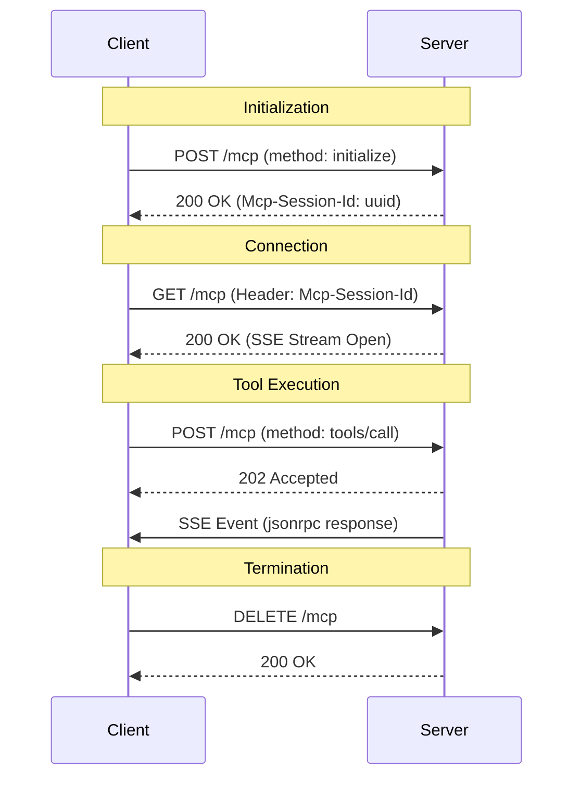

# Easy MCP Server

An MCP server implementation using Streamable HTTP transport (Protocol Version 2025-11-25).

## Features

- **Protocol**: MCP Streamable HTTP (2025-11-25)
- **Transport**: HTTP POST/GET/DELETE
- **Tools**: `add-two-numbers`, `tokenize-prompt`
- **Monitoring**: Health and Info endpoints

## Setup

1. **Install Dependencies**
   ```bash
   npm install
   ```

2. **Build**
   ```bash
   npm run build
   ```

3. **Start Server**
   ```bash
   npm start
   ```

   The server runs on `http://127.0.0.1:8080` by default.

## API Endpoints

- **POST /mcp**: JSON-RPC requests (Initialize, Call Tool, etc.)
- **GET /mcp**: Server-Sent Events (SSE) stream
- **DELETE /mcp**: Terminate session
- **GET /health**: Health check
- **GET /info**: Server information

## Sequence Diagram



## Testing

Run unit tests:
```bash
npm test
```

## Directory Structure

- `src/core/`: Core server logic and transport.
- `src/tools/`: Tool implementations.
- `src/index.ts`: Entry point.
