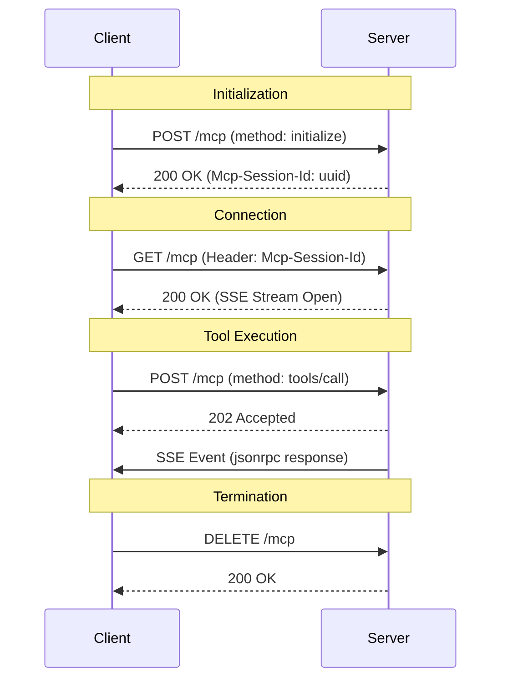

# Easy MCP Server

An MCP server implementation using Streamable HTTP transport (Protocol Version 2025-11-25).

## Features

- **Protocol**: MCP Streamable HTTP (2025-11-25)
- **Transport**: HTTP POST/GET/DELETE
- **Tools**: `hello-world`, `add_two_numbers` (plus Copilot aliases `add-two-numbers`, `welcome`, `greeting`)
   - `add_two_numbers` / `add-two-numbers`: accept `{ "prompt": string }`, extract the first two numbers, return the sum
- **Monitoring**: Health and Info endpoints

## Setup

1. **Install Dependencies**
   ```bash
   npm install
   ```

2. **Build**
   ```bash
   npm run build
   ```

3. **Start Server**
   ```bash
   npm start
   ```

   The server runs on `http://127.0.0.1:8080` by default.

## API Endpoints

- **POST /mcp**: JSON-RPC requests (Initialize, Call Tool, etc.)
- **GET /mcp**: Server-Sent Events (SSE) stream
- **DELETE /mcp**: Terminate session
- **GET /health**: Health check
- **GET /info**: Server information

## Tools (Names + Parameters)

These tool contracts are intentionally explicit so MCP clients (including Copilot plugins) can call tools directly instead of relying on ad-hoc parsing.

### `add_two_numbers` (preferred) / `add-two-numbers` (alias)

- **Purpose**: Add two numbers extracted from the *full user prompt*.
- **Input**:
   - `{ "prompt": string }`
- **Behavior**:
   - Extracts the *first two numbers* from `prompt` (supports negatives and decimals).
   - Errors if fewer than 2 numbers are present.

Client guidance:
- If the user message contains at least two numbers and asks to add/sum/plus/total, call this tool.
- Pass the full user message verbatim as `prompt` (example: `please add following number 10 and 7`).
- **Output**:
   - `structuredContent`: `{ "sum": number }`
   - `content`: text containing the sum

Example JSON-RPC `tools/call`:
```json
{
   "jsonrpc": "2.0",
   "id": 2,
   "method": "tools/call",
   "params": {
      "name": "add_two_numbers",
      "arguments": { "prompt": "please add 10 and 20" }
   }
}
```

### `hello-world`

- **Purpose**: Return the welcome message from `resources/hello-world/welcome.md`.
- **Aliases**: `welcome`, `greeting` (same behavior as `hello-world`)
- **Input**:
   - `{}` (no parameters)
- **Output**:
   - `structuredContent`: `{ "message": string, "mcpSdkVersion": string, "clientName": string, "clientVersion": string }`
   - `content`: text containing the welcome message plus versions

Example JSON-RPC `tools/call`:
```json
{
   "jsonrpc": "2.0",
   "id": 3,
   "method": "tools/call",
   "params": {
      "name": "hello-world",
      "arguments": {}
   }
}
```


## Sequence Diagram



## Testing

Run unit tests:
```bash
npm test
```

## Directory Structure

- `src/core/`: Core server logic and transport.
- `src/tools/`: Tool implementations.
- `src/index.ts`: Entry point.
